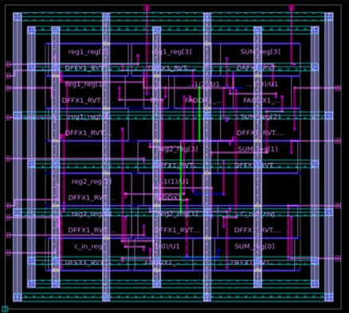

# Figure 11 — Clock Tree Synthesis in IC Compiler II

**Caption:** CTS result in ICC2 showing the balanced clock distribution network. Clock buffers and inverters have been inserted to deliver the clock from the source to all flip-flop clock pins (g[0]–g[3]: DFFX instances, reg, FA logic) with minimal skew and latency, ensuring all sequential elements are synchronized.

**Tool:** Synopsys IC Compiler II (ICC2)  
**Stage:** Clock Tree Synthesis (CTS)  

