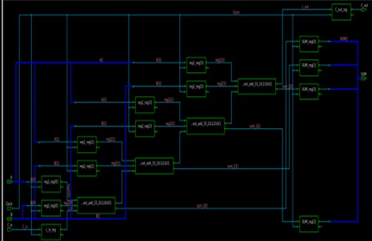

# Figure 3 — TT Corner Timing Analysis

**Caption:** Timing analysis at the Typical-Typical (TT) PVT corner using (a) Compile and (b) Compile Ultra modes in Design Compiler. TT is the baseline reference at nominal process, voltage, and temperature. Timing slack of +0.68 ns was achieved under both modes, confirming the design meets timing at nominal conditions.

**Tool:** Synopsys Design Compiler (DC)  
**Stage:** Multi-corner timing analysis — TT corner (nominal baseline)  

