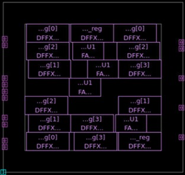

# Figure 9 — Standard Cell Placement in IC Compiler II

**Caption:** Standard cell placement result for the 4-bit Full Adder in ICC2. D flip-flops (DFFX), full adder logic (FA), and buffers (U1) are legally placed within core rows. Cell positions are optimized to minimize estimated wirelength and routing congestion. Post-placement PG connectivity was verified clean.

**Tool:** Synopsys IC Compiler II (ICC2)  
**Stage:** Standard Cell Placement  

