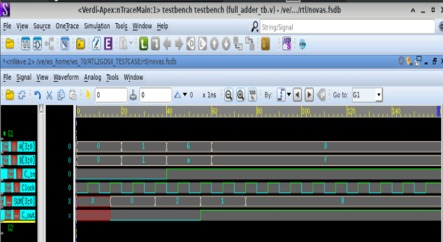

# Figure 1 — Functional Verification in VCS

**Caption:** Functional verification of the 4-bit Full Adder in Synopsys VCS. The left panel shows the Verilog testbench source in the VCS editor, including instantiation of the full_adder module under test, clock generation, and stimulus blocks. The right panel shows simulation waveforms confirming correct functional behaviour of SUM[3:0] and C_out outputs.

**Tool:** Synopsys VCS
**Stage:** RTL Functional Simulation

>
